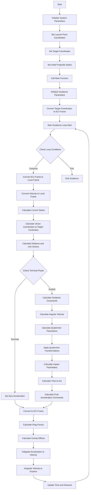
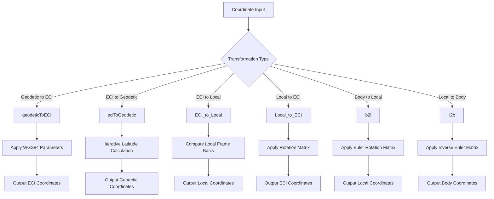
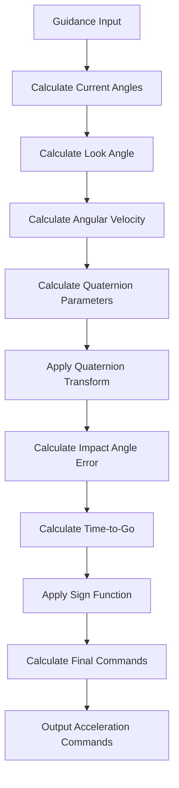
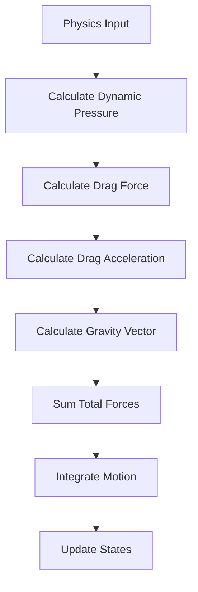

# Guidance System Function Flow Chart

## System Overview

This flowchart represents the function call hierarchy and data flow for the onboard guidance algorithm system.

## Main System Flow

## Coordinate Transformation Subsystem

## Guidance Law Subsystem

## Physics Calculation Subsystem

## Function Dependencies

### Primary Functions

- **Test_OBG.m** - Main test driver
- **onboard_guidance_algorithm_3** - Core guidance algorithm

### Coordinate Transformation Functions

- **geodeticToECI** - Geodetic to ECI conversion
- **eciToGeodetic** - ECI to geodetic conversion
- **ECI_to_Local** - ECI to local frame conversion
- **ECI_to_Local_vel** - ECI velocity to local frame
- **Local_to_ECI** - Local to ECI frame conversion
- **Local_to_ECI_vel** - Local velocity to ECI frame
- **b2l** - Body to local frame conversion
- **l2b** - Local to body frame conversion
- **computeRotationMatrix** - Rotation matrix computation

### Utility Functions

- **sig** - Sign function with power operation

## Data Flow Summary

1. **Initialization Phase**

   - Set system parameters and constants
   - Initialize coordinate frames
   - Set initial conditions

2. **Main Guidance Loop**

   - Coordinate transformations
   - State calculations
   - Guidance law application
   - Physics integration

3. **Output Phase**
   - Final position and velocity
   - Performance metrics
   - System status

## System Interfaces

### Input Interfaces

- Launch point coordinates (lat, lon, alt)
- Target coordinates (lat, lon, alt)
- Initial projectile states (position, velocity)
- Guidance parameters

### Output Interfaces

- Final projectile states
- Guidance commands
- System performance data
- Status information

### Internal Interfaces

- Coordinate transformation functions
- Guidance law calculations
- Physics integration functions
- Utility functions
